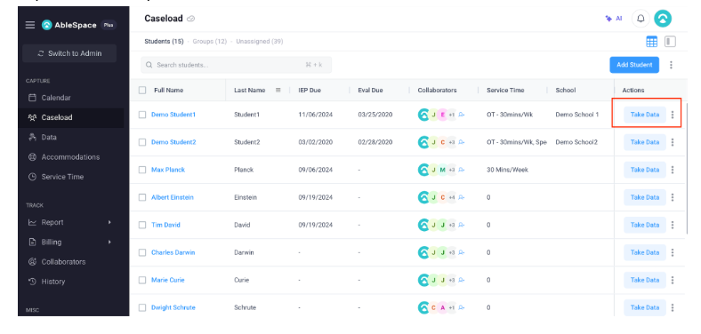

# AbleSpace Product Understanding Submission

## 1. Feature Overview

The **"Take Data"** feature within AbleSpace is the primary data-collection interface designed for special education professionals (Teachers, Speech-Language Pathologists, Occupational Therapists, and School Psychologists).

### Core Objectives:
- **IEP Goal Progress Tracking**: Record live trial data against specific Individualized Education Program (IEP) goals during active student sessions.
- **Trial & Behavior Recording**: Capture quantitative metrics (percentage accuracy, prompt hierarchies, frequency, duration, and interval data).
- **Compliance & Progress Reporting**: Persist session observations directly into automated progress reports and IEP compliance records.

---

## 2. Step-by-Step User Workflow

### Step 1 — Open Caseload
Navigate to the **Caseload** tab from the left sidebar navigation menu under the `CAPTURE` section. View the active caseload overview displaying all assigned students, groups, and unassigned metrics.

### Step 2 — Select Student
Locate the target student row within the Caseload table (using search or filtering). Review student metadata (IEP Due Date, Evaluation Due Date, Collaborators, Service Time, and School).

### Step 3 — Click Take Data
Click the primary blue **"Take Data"** action button located in the rightmost `Actions` column of the student row.

### Step 4 — Record Data
The student's data-collection workspace opens, presenting active IEP goals categorized by domain (e.g., Speech & Language, Motor Skills, Behavioral). Record observation trials using quick interaction controls.

### Step 5 — Save
Save the recorded session observations to persist trials into the system, updating progress reporting context.

---

## 3. UI/UX Observations

| UI Aspect | Technical & Design Observation |
| --- | --- |
| Navigation & Layout | The dark sidebar clearly separates the main navigation from the student data area. The blue Take Data action provides strong visual emphasis for the primary workflow. |
| Information Hierarchy | IEP Due Date, Evaluation Due Date, collaborators, service time, and school information are visible before entering the data-collection workflow. |
| Controls & Inputs | The data-entry controls are designed for quick interaction during live sessions, reducing the number of steps required to record observations. |
| Data Visibility | Relevant student and goal information is presented in context so educators can make data-entry decisions without unnecessary navigation. |
| Feedback Mechanics | Clear visual states and confirmation feedback can help users understand whether their data has been recorded successfully. |

---

## 4. Key UX Strengths

- **Classroom Speed & Efficiency** — The direct Take Data action provides quick access to the data-collection workflow.
- **Contextual Clarity** — Keeping student and goal-related information close to the data-entry workflow reduces unnecessary navigation.
- **Structured Data Collection** — Standardized data-entry methods can help maintain consistency across different professionals and sessions.

---

## 5. Improvements

- **Offline Data Resilience**: Add an offline ServiceWorker buffer (IndexedDB) with an explicit sync status indicator to handle unreliable school connectivity.
- **Group Session Mode**: Introduce multi-student tracking to reduce repetitive navigation when professionals work with multiple students in a group session.
- **Global Quick Access**: Provide a global shortcut (`⌘+K`) to accelerate access to the Take Data workflow for users managing larger caseloads.
- **Voice-Assisted Data Entry**: Provide hands-free interaction, although it would require additional accessibility, privacy, and accuracy considerations.

---

## 6. Prioritization Matrix

| Priority | Improvement | Expected Impact | Rationale |
| --- | --- | --- | --- |
| High | Offline Data Resilience | Critical | Prevents data loss when connectivity is unreliable during classroom sessions. |
| High | Group Session Mode | High | Could reduce repetitive navigation when professionals work with multiple students in a group session. |
| Medium | Global Quick Access | Medium | Could accelerate access to the Take Data workflow for users managing larger caseloads. |
| Low | Voice-Assisted Data Entry | Medium/Low | Could provide hands-free interaction, although it would require additional accessibility, privacy, and accuracy considerations. |
